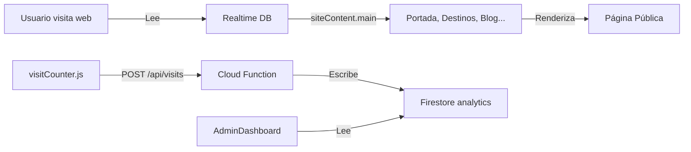
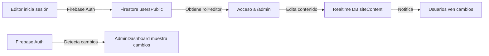
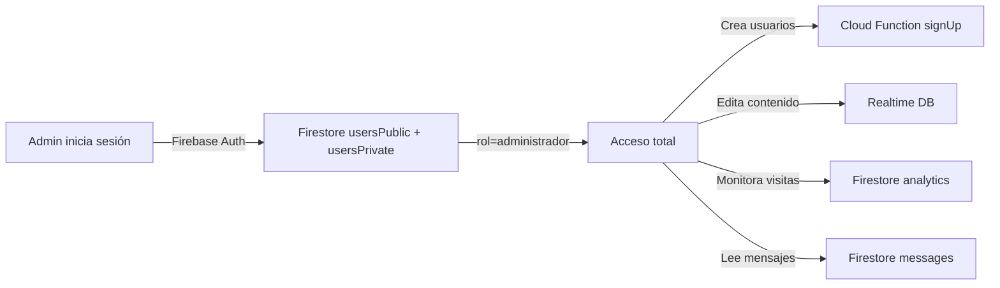

# 🏗️ Arquitectura de Bases de Datos - Visit Santa Rosa

## Diagrama General

```
┌─────────────────────────────────────────────────────────────────┐
│                        APLICACIÓN WEB                            │
│                   (Vite + React + React Router)                  │
└─────────────────────────────────────────────────────────────────┘
        │
        ├─────────────────────┬──────────────────────┬──────────────┐
        │                     │                      │              │
        ▼                     ▼                      ▼              ▼
    ┌───────┐          ┌───────────┐         ┌──────────┐      ┌────────┐
    │ Login │          │   CMS     │         │ Analytics│      │Storage │
    │ (Auth)│          │(Contenido)│         │(Métricas)│      │(Imágenes)
    └───────┘          └───────────┘         └──────────┘      └────────┘
        │                     │                      │              │
        │ Firebase Auth       │ Realtime DB          │ Firestore    │
        │ + Firestore         │ (Pública)            │ (Privada)    │
        │                     │                      │              │
        └─────────────────────┼──────────────────────┼──────────────┘
                              │
        ┌─────────────────────┴──────────────────────┬──────────────┐
        │                                            │              │
        ▼                                            ▼              ▼
    ┌─────────────────────┐             ┌──────────────────┐   ┌────────┐
    │  FIREBASE PROJECT   │             │ CLOUD FUNCTIONS  │   │Storage │
    │                     │             │                  │   │Bucket  │
    │ ┌─────────────────┐ │             │ • countVisit()   │   └────────┘
    │ │   Firestore     │ │             │ • webhooks       │
    │ │                 │ │             └──────────────────┘
    │ │ • usersPublic   │ │
    │ │ • usersPrivate  │ │
    │ │ • messages      │ │
    │ │ • surveys       │ │
    │ │ • analytics     │ │
    │ └─────────────────┘ │
    │                     │
    │ ┌─────────────────┐ │
    │ │  Realtime DB    │ │
    │ │                 │ │
    │ │ • siteContent   │ │
    │ │   - portada     │ │
    │ │   - destinos    │ │
    │ │   - eventos     │ │
    │ │   - blog        │ │
    │ │   - galería     │ │
    │ │   - gastronomía │ │
    │ │   - hospedajes  │ │
    │ │   - flora/fauna │ │
    │ │   - cooperativas│ │
    │ └─────────────────┘ │
    │                     │
    └─────────────────────┘
```

## 📊 Flujo de Datos - Operación Normal

### 1. **Login de Usuario**

```
Usuario escribe email/password
        ↓
    Validar localmente ✓
        ↓
¿Firebase disponible?
    ↙           ↘
   SI            NO
    ↓             ↓
Usar Firebase  Usar fallback local
User → Firestore  User → localStorage
```

### 2. **Lectura de Contenido Público**

```
Página pública (QueHacer, Blog, etc)
        ↓
ContentContext
        ↓
Lee de Realtime DB (sin autenticación)
        ↓
Renderiza 20x más rápido ⚡
(0 consumo de cuota Firestore)
```

### 3. **Edición de Contenido (Admin)**

```
Admin edita en /admin
        ↓
ContentContext
        ↓
Guarda en Realtime DB
        ↓
Firestore recibe evento
        ↓
Página pública se sincroniza ✓
```

### 4. **Registro de Visitas**

```
Usuario visita /destinos
        ↓
recordVisit("/destinos")
        ↓
POST /api/visits (Cloud Function)
        ↓
Valida origen + throttle anti-bot
        ↓
Escribe en analytics/traffic
        ↓
AdminDashboard muestra en vivo
```

## 🔐 Seguridad por Capas

### Capa 1: Firestore (Privada)

```
Autenticación: REQUERIDA
┌──────────────────────────┐
│ usersPublic              │ → Todos ven roles/nombres
│ usersPrivate             │ → Solo admin ve emails
│ messages                 │ → Solo admin lee
│ analytics                │ → Solo admin + Cloud Function
└──────────────────────────┘
```

### Capa 2: Realtime DB (Semipública)

```
Autenticación: OPCIONAL
┌──────────────────────────┐
│ siteContent.main         │ → Todos LEN, admin ESCRIBE
│ (lectura pública)        │
└──────────────────────────┘
```

### Capa 3: Cloud Functions (Backend)

```
Sin exposición directa
┌──────────────────────────┐
│ countVisit()             │ → Valida y escribe en analytics
│ (throttling anti-bot)    │ → Solo lectura de RTDB
│                          │ → Solo escritura a Firestore
└──────────────────────────┘
```

## 💾 Sincronización en Tiempo Real

### Realtime DB → UI

```
RTDB siteContent.main
        ↓
onValue() listener
        ↓
setContent() state
        ↓
Re-render componentes
        ↓
UI actualizada ⚡ (50ms)
```

### Firestore → UI

```
Firestore users* analytics*
        ↓
onSnapshot() listeners
        ↓
setUsers() setMetrics()
        ↓
Re-render admin
        ↓
UI actualizada ⚡ (100-500ms)
```

## 🎯 Casos de Uso

### ✅ Visitor - Usuario Público



### ✅ Editor - Usuario Autenticado



### ✅ Admin - Control Total



## 🔄 Flujo Completo: Editar un Evento

```
1. Admin abre AdminEventos
   └─> ContentContext carga eventos de Realtime DB

2. Admin edita evento "Feria Agrícola"
   └─> Estado local se actualiza
   └─> Preview se actualiza en tiempo real

3. Admin hace click "Guardar"
   └─> Guarda en Realtime DB
   └─> success: "✓ Cambios guardados"

4. Otros admins ven el cambio
   └─> onValue listener en RTDB
   └─> Estado se sincroniza
   └─> Panel de admin se actualiza

5. Usuario público visita /eventos
   └─> Carga desde Realtime DB (sin auth)
   └─> Ve el evento actualizado ⚡

6. AdminDashboard muestra métrica
   └─> recordVisit("/eventos")
   └─> analytics/traffic actualizado
   └─> Métrica en vivo en dashboard
```

## 📈 Consumo de Cuota

### ❌ SIN Realtime DB (solo Firestore)

```
Cada página pública = 1 lectura Firestore
100 usuarios simultáneos = 100 operaciones/página
1000 páginas vistas = 1000 lecturas
→ $0.06 - $0.60 por día
```

### ✅ CON Realtime DB (arquitectura actual)

```
Cada página pública = 0 lecturas Firestore
Contenido servido desde RTDB (gratis con plan gratuito)
Solo admin genera escrituras Firestore
→ $0 - $0.06 por día
```

**Ahorro: ~90%** 🎉

## 🚀 Deploy - Configuración en Producción

### Firebase Console

```
1. Firestore
   - Modo: Producción (no desarrollo)
   - Ubicación: us-central1
   - Índices automáticos: SÍ

2. Realtime Database
   - Modo: Producción
   - Ubicación: us-central1
   - Reglas: firestore.rules (RTDB rules format)

3. Authentication
   - Proveedores: Email/Password
   - Usuarios: Creados desde admin

4. Storage
   - Versión: v9
   - CORS: Configurado para dominio
```

### Deployment

```
vercel deploy
    ↓
Google Cloud Run (si usas Cloud Functions)
    ↓
Firebase Hosting (alternativa)
```

## 🐛 Debugging

### Ver datos en Firestore

```
Firebase Console > Firestore > Colecciones
- Verifica usersPublic tiene usuarios
- Verifica usersPrivate tiene emails
- Verifica analytics tiene tráfico
```

### Ver datos en Realtime DB

```
Firebase Console > Realtime Database > Datos
- Verifica siteContent.main existe
- Verifica portada, destinos, eventos tienen contenido
```

### Ver logs de Cloud Functions

```
Google Cloud Console > Logs > Cloud Functions
- Verifica countVisit() se ejecuta sin errores
- Verifica no hay rechazos de CORS
```

### Consola del Navegador

```
F12 > Console
- Busca "Firebase Auth error"
- Busca "RTDB error"
- Busca "Cloud Function error"
```
